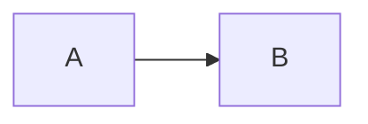
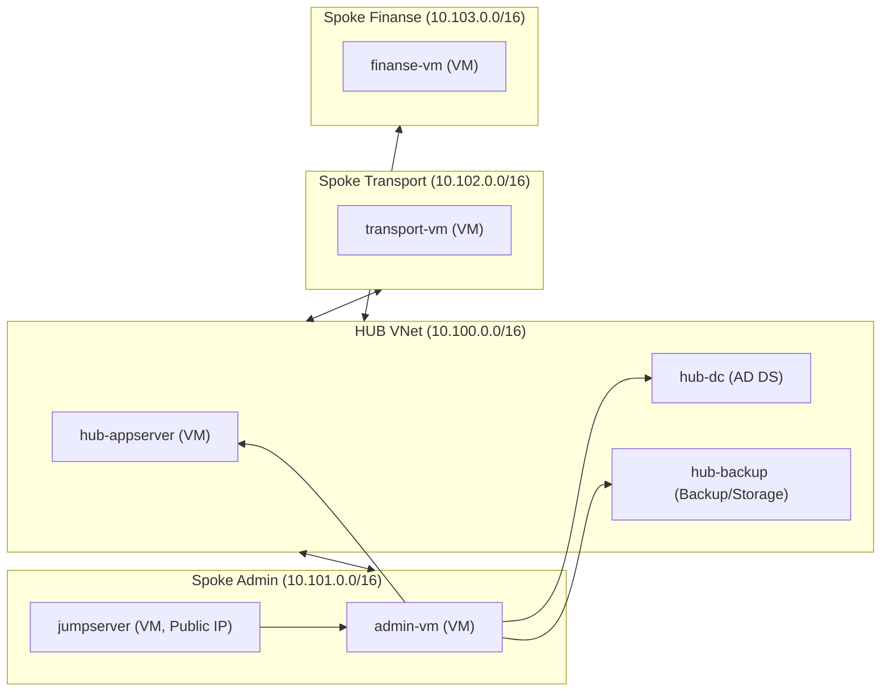

```mermaid
flowchart LR
    A --> B
```

```mermaid
flowchart LR

    subgraph HUB["HUB VNet (10.100.0.0/16)"]
        A1["hub-appserver (VM)"]
        A2["hub-dc (AD DS)"]
        A3["hub-backup (Backup/Storage)"]
    end

    subgraph ADMIN["Spoke Admin (10.101.0.0/16)"]
        B1["admin-vm (VM)"]
        B2["jumpserver (VM, Public IP)"]
    end

    subgraph TRANSPORT["Spoke Transport (10.102.0.0/16)"]
        C1["transport-vm (VM)"]
    end

    subgraph FINANSE["Spoke Finanse (10.103.0.0/16)"]
        D1["finanse-vm (VM)"]
    end

    HUB <--> ADMIN
    HUB <--> TRANSPORT
    HUB <--> FINANSE

    B2 --> B1
    B1 --> A1
    B1 --> A2
    B1 --> A3
```
